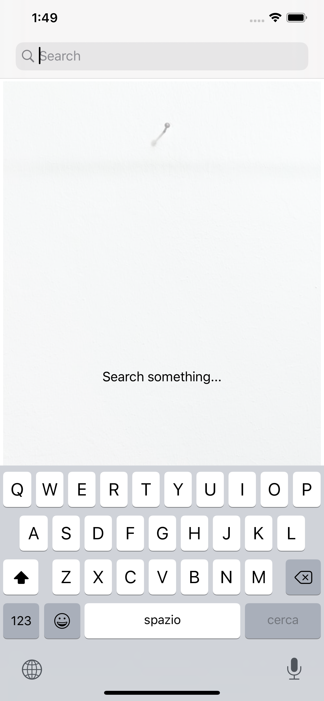
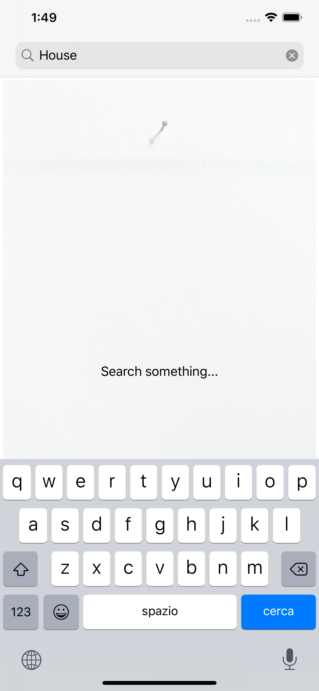
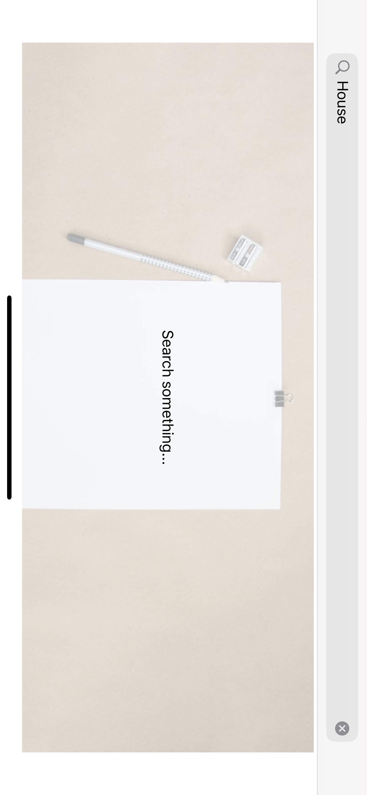
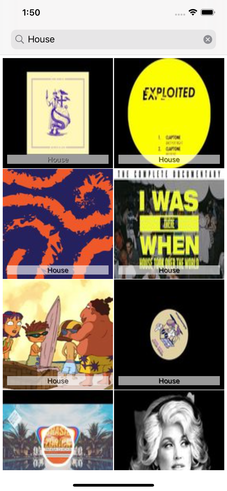
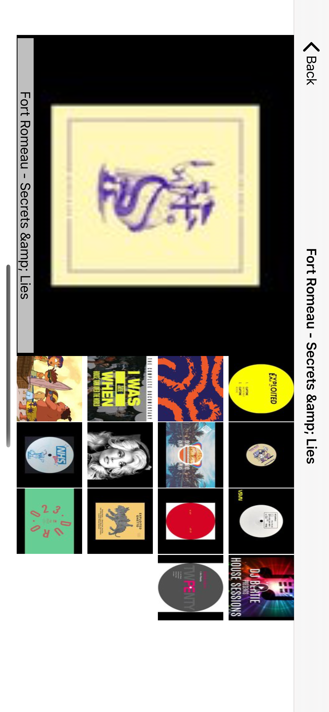
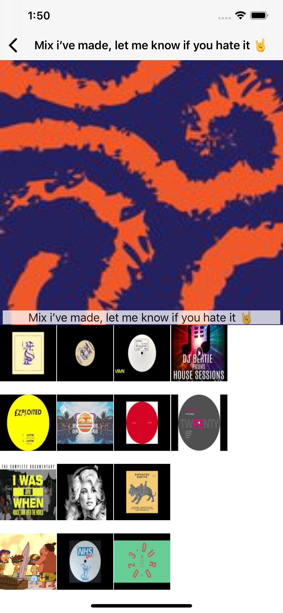
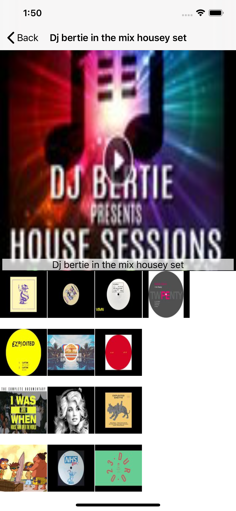
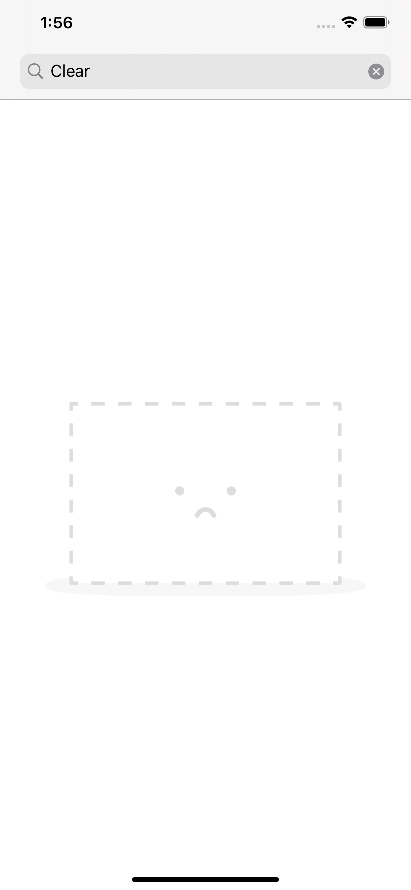

# Welcome to rgallery!

**rgallery** is an iOS photo gallery application that allows searching on Reddit using the following search query: `https://www.reddit.com/r/{KEYWORD}/top.json` in order to render the images that are obtained in a grid view.

The application has two main screens: in the first there is a search bar that can be used to enter the word to be searched, while the second provides an enlarged view of the selected image and also a list of related images. For more details, see the [TDD](#TDD) section of this document and/or some [screenshots](#Screenshots).

# Technical details

|                |ASCII                          |
|----------------|-------------------------------|
|Xcode 			 |`'11.1'`            			 |
|Swift	         |`5`            				 |
|TargetSDK       |`13`							 |
|Language        |`English`/`Italian`			 |
|Chache support  |`Yes`			 				 |
|UI/Unit Tests   |`XCTests`		 				 |
|TDD             |`Yes`		 				 |

# TDD

```
Scenario Outline: Verify whether the app is loaded correctly in PORTRAIT mode
 Given I open the rgallery app with an iphone/ipad device set to <language> in PORTRAIT mode
 And I see the loading screen
 When the loading screen will disappear
 Then I should see the search_bar on the top of the page
 And the search_bar should contains the placeholder <placeholder> 
 And I should see the label aligned to the center x/y
 And I should see the PORTRAIT_MODE_IMAGE_PLACEHOLDER
 And the label should contains the text <text>

Examples:
| language | placeholder | text                 |
| english  | "Search"    |"Search something..." |
| italian  | "Cerca"     |"Cerca qualcosa..."   |

Scenario Outline: Verify whether the app is loaded correctly in LANDSCAPE mode
 Given I open the rgallery app with an iphone/ipad device set to <language> in LANDSCAPE model
 And I see the loading screen
 When the loading screen will disappear
 Then I should see the search_bar on the top of the page
 And the search_bar should contains the placeholder <placeholder> 
 And I should see the label aligned to the center x/y
 And I should see the LANDSCAPE_MODE_IMAGE_PLACEHOLDER
 And the label should contains the text <text>

Examples:
| language | placeholder | text                 |
| english  | "Search"    |"Search something..." |
| italian  | "Cerca"     |"Cerca qualcosa..."   |

Scenario: Verify the search bar user interaction show RESULTS on the screen
 Given I open the rgallery app with the scenario MOCK_API_WITH_DATA
 And I see the loading screen
 And the loading screen will disappear
 And I should see the search_bar on the top of the page 
 When I insert the text MOCK_API_WITH_DATA_KEYWORD in the search_bar
 And I click on the SEARCH_BUTTON
 And I wait that the data is properly loaded
 Then I should see a GRID_VIEW of thumbnails

Scenario: Verify the search bar user interaction show the error screen
 Given I open the rgallery app with the scenario MOCK_API_WITHOUT_DATA
 And I see the loading screen
 And the loading screen will disappear
 And I should see the search_bar on the top of the page 
 When I insert the text MOCK_API_WITHOUT_DATA_KEYWORD in the search_bar
 And I click on the SEARCH_BUTTON
 And I wait that the data is properly loaded
 Then I should see a NO_RESULT image

Scenario: Verify the search bar cancel button
 Given I open the rgallery app with the scenario MOCK_API_WITH_DATA
 And I see the loading screen
 And the loading screen will disappear
 And I should see the search_bar on the top of the page 
 And I insert the text MOCK_API_WITH_DATA_KEYWORD in the search_bar
 And I click on the SEARCH_BUTTON
 And I wait that the data is properly loaded
 And I should see a GRID_VIEW of thumbnails
 When I click on the CANCEL_BUTTON placed on the search_bar
 Then I should not see the GRID_VIEW
 And I should see the label aligned to the center x/y
 And I should see the LANDSCAPE_MODE_IMAGE_PLACEHOLDER

Scenario: Verify the system keyboard appears after search_bar is selected
 Given I open the rgallery app with the scenario MOCK_API_WITH_DATA
 And I see the loading screen
 And the loading screen will disappear
 And I should see the search_bar on the top of the page 
 When I click on the search_bar
 Then I should see the system_keyboard

Scenario: Verify the system keyboard disappears after SEARCH_BUTTON is pressed
 Given I open the rgallery app with the scenario MOCK_API_WITH_DATA
 And I see the loading screen
 And the loading screen will disappear
 And I should see the search_bar on the top of the page 
 And I click on the search_bar
 And I should see the system_keyboard
 When I click on the SEARCH_BUTTON
 Then the system_keyboard should disappear

Scenario: Verify the DETAILS page is loaded properly
 Given I open the rgallery app with the scenario MOCK_API_WITH_DATA
 And I see the loading screen
 And the loading screen will disappear
 And I should see the search_bar on the top of the page 
 And I insert the text MOCK_API_WITH_DATA_KEYWORD in the search_bar
 And I click on the SEARCH_BUTTON
 And I wait that the data is properly loaded
 And I should see a GRID_VIEW of thumbnails
 When I click on a item located in position x1 y1
 And I wait that the DETAILS_PAGE is loaded properly
 Then I should see the DETAILS_PAGE
 
Scenario: Verify the DETAILS page contents
 Given I open the rgallery app with the scenario MOCK_API_WITH_DATA
 And I see the loading screen
 And the loading screen will disappear
 And I should see the search_bar on the top of the page 
 And I insert the text MOCK_API_WITH_DATA_KEYWORD in the search_bar
 And I click on the SEARCH_BUTTON
 And I wait that the data is properly loaded
 And I should see a GRID_VIEW of thumbnails
 When I click on a item located in position x1 y1 that contains the image THUMB1
 And I wait that the DETAILS_PAGE is loaded properly
 Then I should see the DETAILS_PAGE_FULL_SCREEN_IMAGE_VIEW with the THUMB1 image shown
 And I should see the DETAILS_PAGE_GRID_VIEW
 And the DETAILS_PAGE_GRID_VIEW should not contains the image THUMB1

Scenario: Verify the DETAILS page on RELATED GRID VIEW ITEM
 Given I open the rgallery app with the scenario MOCK_API_WITH_DATA
 And I see the loading screen
 And the loading screen will disappear
 And I should see the search_bar on the top of the page 
 And I insert the text MOCK_API_WITH_DATA_KEYWORD in the search_bar
 And I click on the SEARCH_BUTTON
 And I wait that the data is properly loaded
 And I should see a GRID_VIEW of thumbnails
 And I click on a item located in position x1 y1 that contains the image THUMB1
 And I wait that the DETAILS_PAGE is loaded properly
 And I should see the DETAILS_PAGE_FULL_SCREEN_IMAGE_VIEW with the THUMB1 image shown
 And I should see the DETAILS_PAGE_GRID_VIEW
 And the DETAILS_PAGE_GRID_VIEW should not contains the image THUMB1
 When I click on a item located in position x1 y1 that contains the image THUMB2
 And I wait that the DETAILS_PAGE is loaded properly
 And I should see the DETAILS_PAGE_FULL_SCREEN_IMAGE_VIEW with the THUMB2 image shown
 And I should see the DETAILS_PAGE_GRID_VIEW
 Then the DETAILS_PAGE_GRID_VIEW should not contains the image THUMB1
 And the DETAILS_PAGE_GRID_VIEW should not contains the image THUMB2

Scenario: Verify the CACHING SYSTEM
 Given I open the rgallery app with the scenario MOCK_API_WITH_DATA
 And I see the loading screen
 And the loading screen will disappear
 And I should see the search_bar on the top of the page 
 And I insert the text MOCK_API_WITH_DATA_KEYWORD in the search_bar
 And I click on the SEARCH_BUTTON
 And I wait that the data is properly loaded from API
 And I should see a GRID_VIEW of thumbnails
 And I click on CANCEL_BUTTON located on the search_bar
 And I insert the text MOCK_API_WITH_DATA_KEYWORD in the search_bar
 And I click on the SEARCH_BUTTON
 And I wait that the data is properly loaded from CACHE
 And I should see a GRID_VIEW of thumbnails

```

# Screenshots









